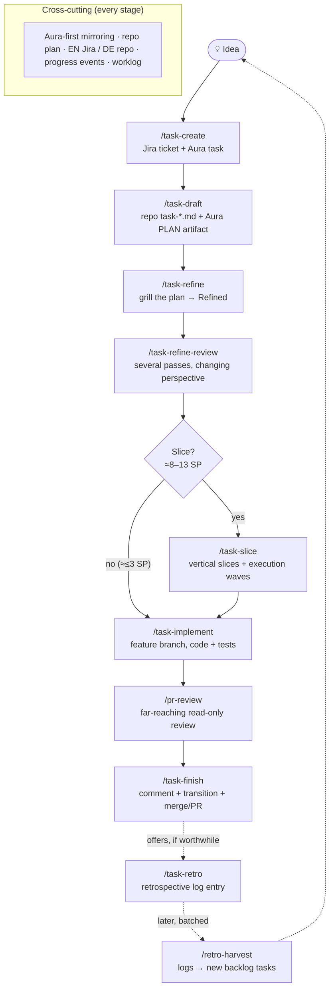

# Development Workflow — The Task Skills (Idea to Merge)

This page describes how we plan and ship work in Aura. Every idea travels the same path from a one-line thought to a merged, human-tested increment. The workflow is implemented as a set of **agent skills** that live in the repository under `.agents/skills/anwaltde/universal/`. Each stage is one slash command an agent (or developer) invokes.

This flow is also the prototype for the guided flows Aura itself will offer non-developers.

## The workflow at a glance

- **Solid arrows** are the main path from idea to merge.
- **`/task-refine-review`** sits between refining and slicing on purpose: a design flaw is cheap to fix in one plan and expensive once it has been multiplied into five slices. After slicing it can run again — then on the **parent** plan, not per slice.
- **`/pr-review`** is offered after implementation and asked again — verbatim, every run — at the start of `/task-finish` (Step 0), so the review sits right before integration.
- **Dotted arrows** are the reflection loop: `/task-finish` offers `/task-retro` when the run was actually worth reflecting on; the accumulated retro logs are later harvested by `/retro-harvest` into fresh backlog tasks — which re-enter the workflow as new ideas.

## Cross-cutting principles

These hold across every stage:

- **Aura-first mirroring.** Jira and Aura are kept in sync, and the **Aura task is always created first** (Aura is the source of truth). The Jira issue is linked back via `linkJiraIssueToTask` *before* any further PATCH, which prevents duplicate Jira issues. The canonical rule is `.cursor/rules/anwaltde/project/jira-aura-mirror.mdc` — the skills apply it, they never restate the mapping.
- **Best-effort Aura.** If any Aura call fails, the skill surfaces a visible warning and proceeds Jira-only. The Jira side and the code are never blocked by an Aura error.
- **The plan lives in the repo.** The canonical plan is a Markdown file under `docs/tasks/active/<KEY>-<slug>/task-<slug>.md`, so the IDE agent reads it with full code context. It is mirrored into Aura as a `PLAN` artifact, and its Bitbucket link is added to the Jira description.
- **Language split.** Jira content (summary, description, comments) is **always English**. Repo Markdown under `docs/tasks/**` is in the instruction language (default German). Translation only ever goes repo → Jira.
- **Progress events.** Each skill emits a best-effort `task.progress` event (`recordTaskProgress`) at start/end so progress is observable.
- **Personal worklog.** Work is tracked in `.aura/worklog/YYYY-MM-DD.md` (`## Aktiv` while running, `## Erledigt` when done), per `worklog-personal-tracking.mdc`.
- **Phase vs. status.** The repo file carries a fine-grained `> **Phase:**` line (`Draft → Refined → Sliced → …`) alongside the coarser Jira `> **Status:**` line.

## Stage 0 — Capture the idea (`/task-create`)

Captures a **new** idea as a Jira ticket (project **ANW**, Topic BFA) plus a mirrored Aura task, and assigns Story Points on the Fibonacci scale (`1, 2, 3, 5, 8, 13`; `13` means "must be sliced later").

- **First action is always the mode question** (`ask_user_question`):
  - **`draft`** *(recommended)* — capture the idea **and** immediately chain into `/task-draft` to write the first draft.
  - **`idea`** — capture the idea only (Jira ticket + Aura task left on `OPEN`); no repo file. The draft can be written later via `/task-draft`.
- Issue types: `Delivery / Discovery / Optimization / Maintenance Story`, or `Bug`.
- Regardless of mode, the ticket ends in Jira status **`Selected`** (transition `111`). Story Points are written to both `customfield_10016` and `customfield_10033`.
- Summary schema `[<Area>] <Title>` — no size token in the title; the effort lives solely in the Story Points field.
- **`task-create` never writes the repo plan itself** — that is `task-draft`'s job.
- **Next step is Draft → Refine, never Slice.** A fresh ticket is never sliced immediately, not even at 13 SP.

## Stage 1 — Write the draft (`/task-draft`)

Turns an already-captured idea into the first usable AI draft: it writes the repo `task-<slug>.md` (mandatory header + rough content blocks), mirrors it as the Aura `PLAN` artifact, adds the plan link to the Jira description, and walks the Aura task to `READY_FOR_REFINEMENT`. Phase after this stage: **`Draft`**.

- Single canonical owner of the repo header/content template.
- Runs standalone on an existing idea (Jira key or Aura task) and is also chained into by `task-create`'s `draft` mode.
- Ensures a **linked pair exists** (Aura task + Jira ticket in `Selected`), creating whichever counterpart is missing.
- **Idempotency guard on both sides:** both present → stop and point at `/task-refine`; exactly one present → reconcile 1:1; neither → draft.
- Rough content blocks: starting situation, target picture, scope, non-goals, assumptions/open questions, affected areas.

## Stage 2 — Work out the plan (`/task-refine`)

Interviews the developer **relentlessly** until reaching shared understanding, resolving each branch of the decision tree one at a time. Phase `Draft → Refined`.

- Resolves the target task explicitly first (a passively open editor file is never evidence of the target) and states it in one sentence before starting.
- Questions are asked **one at a time** via the Q&A module, each with concrete options, the recommended answer first. If a question can be answered by exploring the codebase, do that instead.
- **Didactic lead-in:** every question is preceded by flowing chat prose explaining what it touches and why it matters — refinement actively builds the user's understanding rather than assuming it.
- Optional **clean rewrite** at the end if the plan reads stitched-together, done losslessly.
- On reaching `Refined`: updates the Aura `PLAN` artifact and walks the Aura task `IN_REFINEMENT → READY_FOR_ALIGNMENT`.
- The closing block offers **`/task-refine-review`** as the next step — before slicing, before implementing.

## Stage 3 — Refine review the plan (`/task-refine-review`)

Reads the **finished** plan in several passes, each with a **different guiding question**. It does not replace refining, it comes after it: the plan stands, and the job is to find defects before anything gets built. Core principle — a second pass with the same question finds nothing; what makes a pass productive is a new perspective, not more diligence.

- **Always called a "refine review", never just a "review".** In Aura, "review" already means a review round on an artifact version (assigned reviewers, approvals, ReviseBot) — that is *people* reviewing a document, this is an *agent* reading a plan. Both live on the same artifact, so the names have to stay apart.

**How a run proceeds — seven steps:**

1. **Pick the flow.** A **review run** is the normal case: one or more perspective passes, each followed by the delta beat, until the stop rule ends it. A **delta run** is standalone — no perspective, only the question "what did precisely this change break?", ending after one report. Two switches cut across both: *"run everything"* (no intermediate stops; the decisions are collected and presented at the end) and *"no document"* (the plan exists only in the chat: nothing is patched, nothing logged).
2. **Re-entry check (review runs only).** The first step of every review run, not a mode of its own — that is where both known failures sit. It searches the refine review log under all four spellings and appends to whatever it finds (a second section would split the history in two), subtracts the perspectives already run, and — if convergence had already been reached — sends the work to **build** instead of reviewing again.
3. **Size the run by Story Points** (from the plan header; a spec without a ticket gets an equivalent estimate on the same scale): `1`–`3` → L2 alone, time-boxed · `5` → L1 → L2 · `8`–`13` → L1 → L2 → L3 plus at least one of L4/L5/L6. Regardless of size, a plan that **removes** an existing artifact or **replaces** a running procedure always gets L3 — that is where the pre-existing state lives. The table proposes the order and the upper bound; it never ends a run — ending is the stop rule's job alone.
4. **Run the passes in two-beat measures.** Every perspective pass is followed by a short **delta beat** over exactly what that pass changed: what did precisely these changes break? Where does something still point at a thing that no longer exists? Sharpest after deletions — removed things leave references pointing at them and jobs nobody does any more. Skipped only when a pass changed nothing. `L1 → Δ → L2 → Δ → L3 → Δ → …`
5. **Classify every finding into one of four classes** — blocker, silent gap, contradiction, vagueness. Clear fixes are **patched straight into the working document**; genuine product decisions go back to the user one at a time, each with a recommendation and its trade-off.
6. **Stop on evidence, not on quota.** Keep going while a pass produces blockers, silent gaps, or contradictions; stop when a complete pass produces only vagueness. What is still hidden after that is execution detail, found faster by building the cheapest slice than by reading again. **The stop rule, and only it, ends a run** — the scope table judges from an up-front estimate, the stop rule from what the document actually yields, and the evidence wins.
7. **Report after every pass — and close the session.** Fixed output, sorted by what the reader has to do: every pass ends with a report of two headings — *changed in the plan* and *your call* — so each finding appears **exactly once**: one sentence per settled item, at most three (problem, recommendation, alternative) per decision, framed by a one-line `Checked:` and a one-line `Next:`. A deliberately carried finding lives under *your call* with the condition under which it does bite. A **closing output** follows only when more than one pass ran, and contains just two things: the open decisions with a **deadline class** (`before implementation` / `before the merge` / `can wait`) instead of a priority adjective, and the one next step. Nothing already done is repeated.

**The six perspectives** — each pass reads the whole document with exactly one guiding question:

| # | Perspective | Guiding question | Typically finds |
| --- | --- | --- | --- |
| L1 | **Design** | Is this even the right approach — and does the reasoning hold? | Holes in mechanisms; slices that deliver something other than what their heading claims; load-bearing assumptions that were never stated or checked |
| L2 | **Coherence** | Does the document contradict itself or reality? | Statements that cancel each other out; checks that rely on data declared unreliable elsewhere; stale cross-references; plan versus actual code |
| L3 | **Lifecycle** | What happens the first time, the second time, and with pre-existing data? | First run impossible; existing data never migrated; state that gets created twice; half-migrated intermediate states |
| L4 | **Abort & concurrency** | What if it fails midway, or two actors do it at once? | Half-written target states; missing idempotency on the second attempt; lost work with parallel actors |
| L5 | **Ergonomics** | Will the procedure be worked around in practice? | Ceremony that is too expensive; checks that fire so often they get ignored |
| L6 | **Executability** | Could a simple model implement this without guessing? | Under-specified steps; implicit ordering; missing paths, target values, and verification commands |

**Design before coherence.** Coherence is the cheaper pass and therefore the tempting entry point — but if the design still changes, its fixes were wasted work; the reverse never happens.

- Findings keep their IDs in the document and every pass is logged in the refine review log — one entry per pass in a fixed order of information (perspective · findings by class · what was patched · what stays open · what was verified against the real code), with no prescribed length, because the log's reader is the next agent, not the chat. Older entries in a freer form are left as they are. The Aura artifact is brought in line **once** at the end of the session — and only when no review round is running on that version.
- Works on any plan, spec, or concept document, also **outside** the task workflow. It creates no ticket and no task file of its own.

## Stage 4 — Slice large plans (`/task-slice`)

Breaks a **refined** large story (≈8–13 SP) or a master plan into **vertical, individually human-testable** slices. Only runs after Stage 2 — never on an un-refined ticket.

- **First question is always "slice at all?"** Heuristic:
  - ≈1–3 SP → **no slicing** (implement directly; a `## Slicing-Entscheidung` note is left in the parent file).
  - 5 SP → judgment call.
  - ≈8–13 SP → **slice**.
- **Hard core principle** — every slice is: (1) a **vertical** cut (backend + frontend together, never "all migrations"); (2) **human-testable** via a numbered `## Human test` block; (3) incrementally valuable; (4) explicit about debug intermediate steps and their rollback; (5) context-complete for the assigned model tier.
- Slices are grouped into **execution waves** from their dependency graph — slices in the same wave have no interdependency and can run in parallel.
- Each slice becomes a Jira `Sub-Task` (`parent = <KEY>`, transition `101` → `Selected`, `customfield_10016` for SP — **never** `customfield_10001`) plus a repo file `subtasks/S<n>-<SUB-KEY>-<slug>.md`, and an Aura `SUBTASK` with `BLOCKS` relations reflecting the waves. Parent phase becomes **`Sliced`**.

## Stage 5 — Implement (`/task-implement`)

Brings up a per-worktree dev stack for the feature branch and implements the ticket. Detects the mode from the plan file.

- **Un-sliced:** implement the whole scope in one pass. Asks first where to work (feature-branch worktree, recommended, vs. directly on `develop`) and whether to spin up a test container (`task upd:app` — starts only `app-<token>` in the single `aura` Compose project, no rebuild, shared infra untouched).
- **Sliced:** wave-by-wave on a **two-level worktree model** — the parent branch has its own worktree; each slice of a wave runs in its own worktree branched from the parent, implemented by a **parallel subagent**, then merged back into the parent sequentially. The loop **waits for the user** between waves.
- **Database rule (critical):** the shared `app` DB is never migrated directly. If a branch/slice introduces a migration, fork first (`task db:fork -- <token>`), migrate the fork, and leave reconciliation to `task-finish`.
- **Verification is the automated test suite, not a browser.** During implementation only the scoped tests plus the **fast lane** (`task test-fast`) run; the full `task test` suite is the release gate at `/task-finish`. The in-browser manual test is **handed to the human** via the finish output — the agent never drives a browser to "confirm it works".
- Aura walk: `IN_DEVELOPMENT` on start; single ticket → `READY_FOR_REVIEW`; each completed slice → `DONE` (parent stays open).
- Ends with a mandatory finish block (plain-language "what/how to test" + Test-URL/container/worktree + a specific Testen checklist), then **offers `/pr-review`** as the next step.

## Stage 6 — Review the branch (`/pr-review`)

A far-reaching, opinionated review of the feature branch — **not** a naming/formatting pass. It is offered after implementation and, crucially, is the **first question `/task-finish` asks on every run** (Step 0, no persistent state), so a review sits right before integration. The skill is self-contained: it carries its own quality bar and assumes no IDE rule is in context.

- **Two operating modes, established in Step 0 before anything else.** The signal is a tool, not an environment variable: **is `emit_review` available?** If yes, this is the **pull-request mode** — a headless agent on a Bitbucket PR, driven by `src/server/processes/pr-review-run.ts`, which has already cloned the repo, resolved the merge-base and placed the diff in the system prompt. That agent has **no shell and no git**: it cannot check out, commit, or clean up, it has nobody to ask, and its output *is* the `emit_review(verdict, reportMarkdown)` call. If `emit_review` is absent, this is **local mode** on a developer's machine, with git, `ask_user_question`, and a report in the chat. The mode is named out loud, and every workflow step states what applies in which one. *(Pi: `emit_review` is the Cline headless output tool, not a pi tool — pi has no `emit_review`, so this resolves to **local mode** today; the pull-request/headless path is a deferred adaptation until a pi-side headless PR-review runner provides an equivalent output channel.)*
- **Commit gate (local mode only).** A worktree only ever shows *committed* state, so anyone who runs `/pr-review` on uncommitted work would silently review a state they did not mean. Before reading anything, `git status` decides, in this fixed order — clean → carry on · dirty but on a *different* branch than the one being reviewed → print one line and carry on (a commit would land on the wrong branch) · dirty, branch matches, linked worktree → **commit it** (`git add -A`, message derived from the diff) and carry on · dirty, branch matches, base checkout → stop and ask. The commit is real, stays in the history, and is always reported with hash, message, and its undo (`git reset --soft HEAD~1`).
- **Reading path (local mode).** On your **own** branch the review reads **in place** — after the commit gate the tree is clean, which removes the whole reason for isolation. Any **other** branch gets a `--detach` worktree under the dedicated `_pr-review/` namespace, cleared of leftovers first and removed afterwards. `--detach` is required because a branch already checked out in a neighbouring worktree cannot be checked out again — the normal case in this repo — and the separate namespace exists because `--force` removal in the real ticket-worktree directory would be a destructive command against work in progress.
- **Determines the intent** ("the should") from the branch's `ANW-` key → the repo plan (`docs/tasks/active/<KEY>-*/task-*.md`), so scope fidelity is measured against the actual plan. This step is identical in both modes.
- Reviews along **four dimensions** — identical in both modes, which is why there is one skill and not two:
  - **Scope** — did it do the right thing, and *only* that? A large, unplanned new concept smuggled in (something that would warrant its own ticket) is a **Blocker** and forces at least a "changes needed" verdict.
  - **Quality** — a strict maintainability audit; looks for "code-judo" simplifications that delete whole branches/layers, not cosmetic nits.
  - **Concepts** — are new abstractions at the right boundary, modular, and reusable, or one-offs the next task must rework?
  - **Completeness** — unhandled edge cases, dead paths, `TODO`/`FIXME` remnants, missing error handling.
- **The review itself is read-only.** The commit gate is the single write in the skill, and it runs *before* the review. Verification of a specific finding may run a typecheck, lint, or a test — locally; headless it means reading more files, and an unverifiable finding is named as unverified rather than asserted.
- Output is a Markdown report: a clear **verdict first** (`Mergebar` / `Änderungen nötig` / `Konzept überdenken`), then findings grouped by dimension with `file:line` references and severities (Blocker / Major / Minor), then an explicit loose-ends list. Headless, the matching `mergeable` / `changes needed` / `rethink approach` goes to `emit_review`. *(Pi: report the verdict in the chat in local mode — `emit_review` is not a pi tool; the headless path is deferred, see the Step 0 note.)*

## Stage 7 — Finish (`/task-finish`)

Closes out an implemented ticket in one pass.

- **Step 0 — review & retro offers:** always offers `/pr-review` first (asked every run, no persistent state); a `changes needed` / `rethink approach` verdict is surfaced, not swallowed. It also offers `/task-retro` — but **only when the run's own self-assessment recommends one** (deviations, blockers, or new/complex work); a smooth, low-friction run gets no retro offer at all.
- Can create a Jira ticket **retroactively** if none exists (no repo folder).
- **Pre-flight:** Topic 8 gate, auto-assign if unassigned, add to the active sprint, and set the target-release label `AURA-<version>` (derived from the highest git tag `+1` major `.0`), mirrored onto Aura as a `RELEASE-*` tag.
- **One bundled question** for target status **and** integration path:

  | Option | Jira target | Aura target |
  |---|---|---|
  | Needs Testing | `Needs Testing` | `IN_REVIEW` |
  | **Ready for Deployment** *(default)* | `Ready for Deployment to Production` | `READY_FOR_DEPLOYMENT` (stops here) |
  | Fertig | `Fertig` | `DONE` |

  Integration: **Bitbucket PR** (recommended) · local merge (never pushes) · nothing.
- Posts the **same English comment** (delivered scope + deviations) to Jira and Aura, transitions the ticket (transition ID resolved dynamically — sub-tasks differ from stories), syncs the repo `> **Status:**` line, and archives the folder for "Ready for Deployment"/"Fertig".
- **Release gate:** on a PR or local merge, the full `task test` suite runs before integrating. Local merge also reconciles fork migrations into the shared `app` DB (`prisma migrate deploy`, forward-only) and tears down the fork, container, worktree, and branch.
- Ends with the green `# ✅ Fertig — Ticket <KEY> abgeschlossen` marker only on a clean run.

## Stage 8 — Retrospective (`/task-retro`)

Captures an implementation retrospective for the work just done and appends it as a single, fixed-template entry under `.aura/optimizations/retros/`. It is **part of the workflow's improvement loop**: offered (never automatic) from `/task-finish` Step 0 when the run was worth reflecting on, and also invokable directly.

- **Self-analysis, no interview.** The AI reflects on the session itself — what was built, what took long / caused problems (with causes where known), and actionable improvement suggestions (ideally naming the canonical owner: a skill, rule, script, the Taskfile, or a product endpoint).
- **Plan- and ticket-independent.** Runs against whatever the session actually did; missing `Jira:` / `Aura:` fields are filled with `n/a` rather than blocking.
- Writes one English Markdown file per retro (`<YYYY-MM-DD>-<KEY>.md`, collisions suffixed `-2`, `-3`, …), then shows the rendered entry. It only **records** — it never fixes the findings itself.
- **Closing the loop — `/retro-harvest`:** run occasionally (not per ticket), it reads the accumulated retro logs, splits them into atomic suggestions, consolidates recurring ones, and — on the user's confirmation — turns the actionable ones into real backlog tasks via the `/task-create` convention, writing each new task key back into the source logs and archiving fully resolved ones. Those tasks re-enter the workflow at Stage 0.

## Repo folder lifecycle

| State | Location |
|---|---|
| Active | `docs/tasks/active/<KEY>-<slug>/` |
| Done / cancelled | `docs/tasks/archive/<KEY>-<slug>/` |

## Source

- Skills: `.agents/skills/anwaltde/universal/task/` and `.agents/skills/anwaltde/universal/pr-review/` in the `aura` repository.
- Mirroring rule: `.cursor/rules/anwaltde/project/jira-aura-mirror.mdc`.
